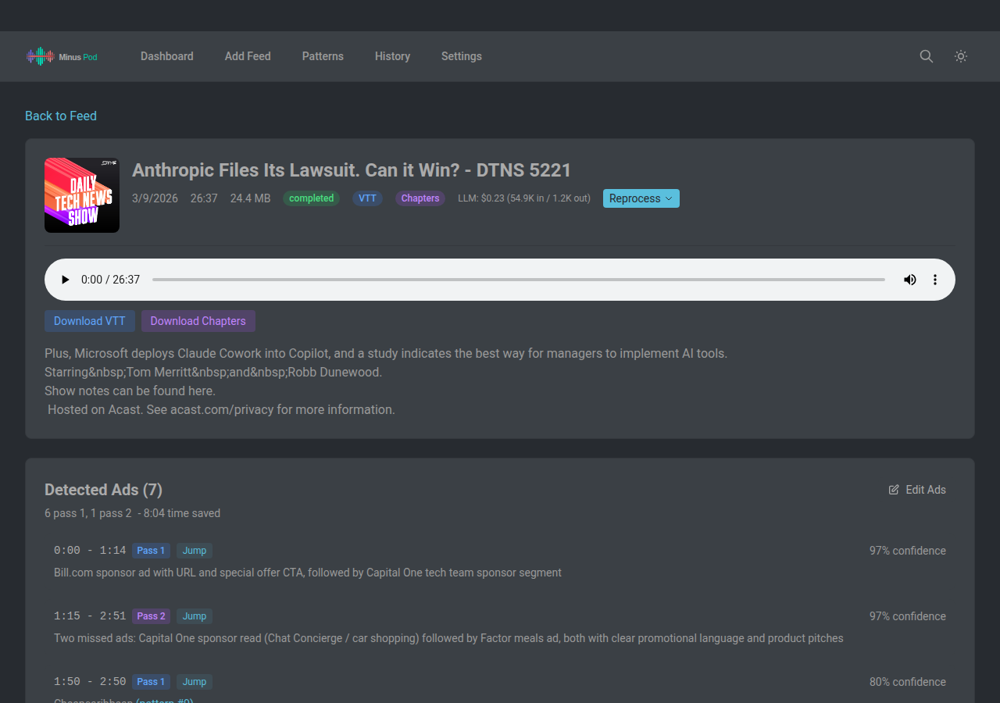
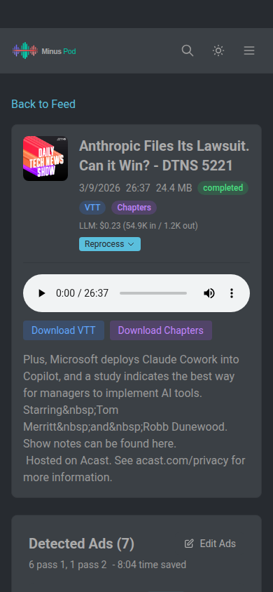
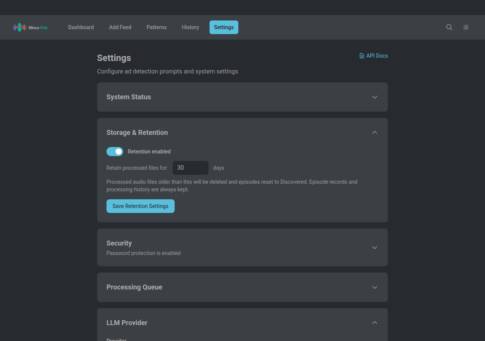
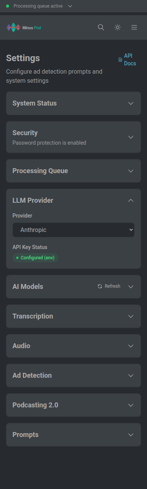
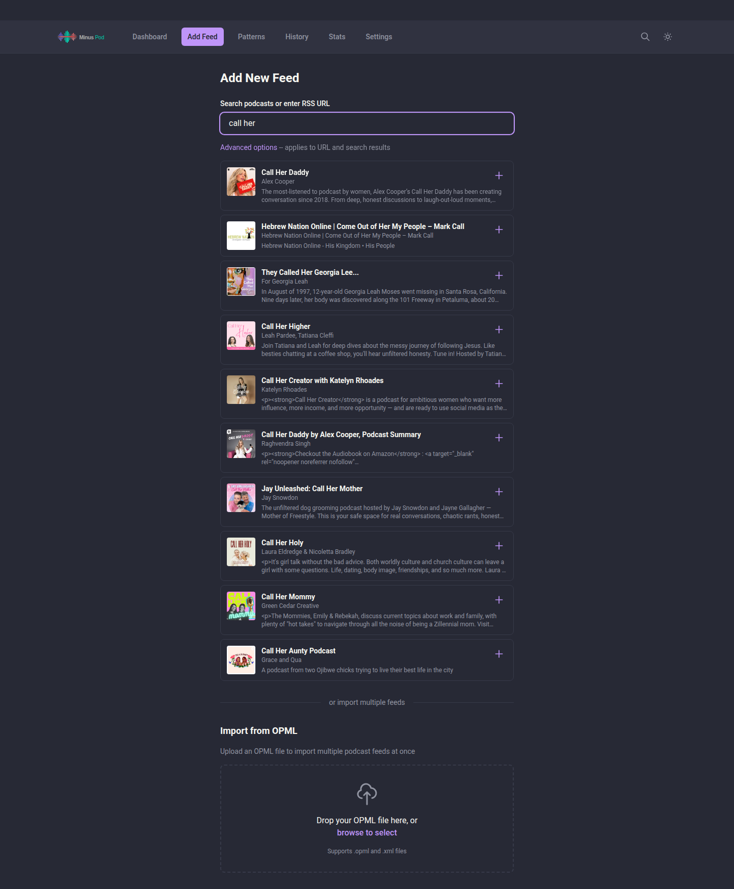

<p align="center">
  
</p>

MinusPod is a self-hosted server that removes ads before you ever hit play. It transcribes episodes with Whisper, uses an LLM to detect and cut ad segments, and gets smarter over time by building cross-episode ad patterns and learning from your corrections. Bring your own LLM -- Claude, Ollama, OpenRouter, or any OpenAI-compatible provider.

## Table of Contents

- [How It Works](#how-it-works)
- [Advanced Features (Quick Reference)](#advanced-features-quick-reference)
- [Requirements](#requirements)
- [Quick Start](#quick-start)
- [Upgrading to 2.0.0+](#upgrading-to-200)
- [Web Interface](#web-interface)
  - [Ad Editor Workflow](#ad-editor-workflow)
  - [Screenshots](#screenshots)
- [Configuration](#configuration)
- [Finding Podcast RSS Feeds](#finding-podcast-rss-feeds)
- [Usage](#usage)
  - [Audiobookshelf](#audiobookshelf)
- [Environment Variables](#environment-variables)
  - [Using Claude Code Wrapper (Max Subscription)](#using-claude-code-wrapper-max-subscription)
- [Using Ollama (Local or Cloud)](#using-ollama-local-or-cloud)
- [Whisper / Transcription](#whisper--transcription)
- [Using OpenRouter](#using-openrouter)
- [LLM Pricing](#llm-pricing)
- [API](#api)
- [Webhooks](#webhooks)
- [Remote Access / Security](#remote-access--security)
- [Data Storage](#data-storage)
- [Custom Assets (Optional)](#custom-assets-optional)
- [Disclaimer](#disclaimer)

## How It Works

1. **Transcription** - Whisper converts audio to text with timestamps (local GPU via faster-whisper, or remote API via OpenAI-compatible endpoint)
2. **Ad Detection** - An LLM analyzes the transcript to identify ad segments, with an automatic verification pass
3. **Audio Processing** - FFmpeg removes detected ads and inserts short audio markers
4. **Serving** - Flask serves modified RSS feeds and processed audio files

Processing happens on-demand when you play an episode, or automatically when new episodes appear. An episode is processed once; processing time depends on episode length, hardware, and chosen models. After processing, the output is stored on disk and served directly on subsequent plays.

## Advanced Features (Quick Reference)

| Feature | Description | Enable In |
|---------|-------------|-----------|
| **Verification Pass** | Post-cut re-detection catches missed ads by re-transcribing processed audio | Automatic |
| **Audio Enforcement** | Volume and transition signals programmatically validate and extend ad detections | Automatic |
| **Pattern Learning** | System learns from corrections, patterns promote from podcast to network to global scope | Automatic |
| **Confidence Thresholds** | >=80% confidence: cut (configurable); 50-79%: kept for review; <50%: rejected | Automatic |

See detailed sections below for configuration and usage.

### Verification Pass

After the first pass detects and removes ads, a verification pipeline runs on the processed audio:

1. **Re-transcribe** - The processed audio is re-transcribed on CPU using Whisper
2. **Audio Analysis** - Volume analysis and transition detection run on the processed audio
3. **LLM Detection** - A "what doesn't belong" prompt detects any remaining ad content
4. **Audio Enforcement** - Programmatic signal matching validates and extends detections
5. **Re-cut** - If missed ads are found, the pass 1 output is re-cut directly

Each detected ad shows a badge indicating which stage found it:
- **First Pass** (blue) - Found during first pass detection
- **Audio Enforced** (orange) - Found by programmatic audio signal matching
- **Verification** (purple) - Found by the post-cut verification pass

The verification model can be configured separately from the first pass model in Settings.

### Sliding Window Processing

For long episodes, transcripts are processed in overlapping 10-minute windows:

- **Window Size** - 10 minutes of transcript per API call
- **Overlap** - 3 minutes between windows ensures ads at boundaries aren't missed
- **Deduplication** - Ads detected in multiple windows are automatically merged

A 60-minute episode is processed as 9 overlapping windows, with duplicate detections merged.

### Processing Queue

To prevent memory issues from concurrent processing, episodes are processed one at a time:

- Only one episode processes at a time (Whisper + FFmpeg are memory-intensive)
- Processing runs in a background thread, keeping the UI responsive
- Episodes stuck in "processing" status reset automatically on server restart
- View and cancel processing episodes in Settings

When you request an episode that needs processing:
1. If nothing is processing, it starts in the background and returns HTTP 503 with `Retry-After: 30`
2. If another episode is currently processing, it returns HTTP 503 with `Retry-After: 30`
3. If the queue is busy and the episode gets queued behind another, it returns HTTP 503 with `Retry-After: 60`
4. Once processed, subsequent requests serve the stored file directly from disk

HEAD requests (sent by podcast apps like Pocket Casts during feed refresh) proxy headers from the upstream audio source without triggering processing. This prevents feed refreshes from flooding the processing queue.

### Post-Detection Validation

After ad detection, a validation layer reviews each detection before audio processing:

- **Duration checks** - Rejects ads outside configurable duration limits
- **Confidence thresholds** - Rejects very low confidence detections; only cuts ads above the minimum confidence threshold (adjustable in Settings)
- **Position heuristics** - Boosts confidence for typical ad positions (pre-roll, mid-roll, post-roll)
- **Transcript verification** - Checks for sponsor names and ad signals in the transcript
- **Auto-correction** - Merges ads with tiny gaps, clamps boundaries to valid range

Ads are classified as:
- **ACCEPT** - High confidence, removed from audio
- **REVIEW** - Medium confidence, removed but flagged for review
- **REJECT** - Too short/long, low confidence, or missing ad signals - kept in audio

Rejected ads appear in a separate "Rejected Detections" section in the UI so you can verify the validator's decisions.

### Pattern Learning

When an ad is detected and validated, text patterns are extracted and stored for future matching.

**Pattern Hierarchy:**
- **Global Patterns** - Match across all podcasts (e.g., common sponsors like Squarespace, BetterHelp)
- **Network Patterns** - Match within a podcast network (TWiT, Relay FM, Gimlet, etc.)
- **Podcast Patterns** - Match only for a specific podcast

When processing new episodes, the system first checks for known patterns before sending to the LLM. Patterns with high confirmation counts and low false positive rates are matched with high confidence.

**Pattern Sources:**
- **Audio Fingerprinting** - Identifies DAI-inserted ads using Chromaprint acoustic fingerprints
- **Text Pattern Matching** - TF-IDF similarity and fuzzy matching against learned patterns
- **LLM Analysis** - Falls back to AI analysis for uncovered segments

**User Corrections:**
In the ad editor, you can confirm, reject, or adjust detected ads:
- **Confirm** - Creates/updates patterns in the database, incrementing confirmation count
- **Adjust Boundaries** - Corrects start/end times for an ad; also creates patterns from adjusted boundaries (like confirm), so the learned pattern text matches the corrected range
- **Mark as Not Ad** - Flags as false positive and stores the transcript text. Similar text is automatically excluded in future episodes of the same podcast using TF-IDF similarity matching (cross-episode false positive learning)

**Pattern Management:**
Access the Patterns page from the navigation bar to:
- View all patterns with their scope, sponsor, and statistics
- Filter by scope (Global, Network, Podcast) or search by sponsor name
- Toggle patterns active/inactive
- View confirmation and false positive counts

### Real-Time Processing Status

A global status bar shows real-time processing progress via Server-Sent Events. It displays the current episode title, processing stage (Transcribing, Detecting Ads, Processing Audio), a progress bar, and queue depth. Click it to navigate to the processing episode.

### Reprocessing Modes

When reprocessing an episode from the UI, two modes are available:

- Reprocess (default) -- uses learned patterns from the pattern database plus LLM analysis
- Full Analysis -- skips the pattern database entirely for a fresh LLM-only analysis

Full Analysis is useful when you want to re-evaluate an episode without learned patterns (e.g., after disabling patterns that caused false positives).

### Audio Analysis

Audio analysis runs automatically on every episode (lightweight, uses only ffmpeg):

- **Volume Analysis** - Detects loudness anomalies using EBU R128 measurement. Identifies sections mastered at different levels than the content baseline.
- **Transition Detection** - Finds abrupt frame-to-frame loudness jumps that indicate dynamically inserted ad (DAI) boundaries. Pairs up/down transitions into candidate ad regions.
- **Audio Enforcement** - After LLM detection, uncovered audio signals with ad language in the transcript are promoted to ads. DAI transitions with high confidence (>=0.8) or sponsor matches are also promoted. Existing ad boundaries are extended when signals partially overlap.

## Requirements

- Docker with NVIDIA GPU support (for local Whisper), **or** a [remote Whisper backend](#whisper--transcription) (no GPU needed)
- Anthropic API key, [OpenRouter](https://openrouter.ai) API key, [Ollama](https://ollama.com) for local inference, **or** any OpenAI-compatible endpoint

### Memory Requirements

**GPU VRAM:**

| Whisper Model | VRAM Required |
|---------------|---------------|
| tiny | ~1 GB |
| base | ~1 GB |
| small | ~2 GB |
| medium | ~4 GB |
| large-v3 | ~5-6 GB |
| turbo | ~5 GB |

**System RAM:**

| Episode Length | RAM Required |
|----------------|-------------|
| < 1 hour | 8 GB |
| 1-2 hours | 8 GB |
| 2-4 hours | 12 GB |
| > 4 hours | 16 GB |

## Quick Start

```bash
# 1. Create environment file
cat > .env << EOF
ANTHROPIC_API_KEY=your-key-here
BASE_URL=http://localhost:8000
APP_PASSWORD=your-password
MINUSPOD_MASTER_PASSPHRASE=long-random-string-you-will-not-lose
EOF

# 2. Create data directory
mkdir -p data

# 3. Run
docker-compose up -d
```

Access the web UI at `http://localhost:8000/ui/` to add and manage feeds.

`MINUSPOD_MASTER_PASSPHRASE` is strongly recommended for production. Without it, provider API keys go into the database as plaintext. Setting it later migrates existing plaintext rows to `enc:v1:` encrypted storage on the next boot, with a mandatory pre-migration SQLite snapshot in `data/backups/`. Restoring a backup requires the same passphrase that created it, so pick a long random value and keep it somewhere separate from the database.

## Upgrading to 2.0.0+

The 2.0.0 release is a security hardening milestone. Full detail in `CHANGELOG.md`; the bits that actually affect a deploy:

- `SESSION_COOKIE_SECURE` defaults to `true`. Plain-HTTP setups must set `SESSION_COOKIE_SECURE=false`.
- `SESSION_COOKIE_SAMESITE` defaults to `Strict`. Override to `Lax` only if an integration breaks.
- `flask-cors` is gone. Frontend and API must share an origin; put them behind the same reverse proxy.
- Every mutating `/api/v1/*` request needs an `X-CSRF-Token` header matching the `minuspod_csrf` cookie. The frontend does this automatically; custom API clients have to echo the cookie value.
- Login lockout: 5 fails from the same public IP in 15 min locks that IP for 15 min. Behind a proxy, set `MINUSPOD_TRUSTED_PROXY_COUNT=1` or the lockout keys on the proxy hop.
- The `OPENAI_API_KEY` -> `ANTHROPIC_API_KEY` fallback is removed. Set `OPENAI_API_KEY` explicitly for OpenAI-compatible providers; a startup WARN fires when the old shape is detected.
- Container runs as UID 1000. First boot chowns the data volume; `APP_UID`/`APP_GID` override if the host volume needs a different owner.

## Web Interface

The server includes a web-based management UI at `/ui/`:

- Dashboard with feed artwork and episode counts
- Add feeds by RSS URL with optional episode cap
- Feed management: refresh, delete, copy URLs, set network override, per-feed episode cap
- Episode discovery: all episodes surface on refresh, process any episode from the feed detail page
- Bulk actions: select multiple episodes to process, reprocess, reprocess (full), or delete
- Sort by publish date, episode number, or creation date; paginated (25/50/100/500 per page)
- Pattern management: view and manage cross-episode ad patterns with sponsor names
- Processing history with stats, filtering by podcast, and CSV/JSON export
- Stats dashboard with charts: avg/min/max metrics, top podcasts by ads, episodes by day, token usage, sortable podcast table
- Settings for LLM provider, AI models, ad detection prompts, retention, system stats, token usage and cost
- Real-time status bar showing processing progress across all pages
- OPML export with original or ad-free (modified) feed URLs
- Per-feed auto-process control (enable, disable, or use global default)
- Webhook notifications for processed episodes and auth failures
- Podcast search via PodcastIndex.org
- Multiple dark themes (Tokyo Night, Dracula, Catppuccin, Nord, Gruvbox, Solarized, and more) with light/dark toggle
- Installable as Progressive Web App (PWA)

### Ad Editor Workflow

The ad editor supports two review modes, selected by a toggle above the ads list:

- **Processed** (default) -- plays the post-cut output so you can verify what the final listener will hear. Ad timestamps map onto the new timeline.
- **Original** -- plays the pre-cut download at the ad's original timestamps, so you can hear exactly what was removed.

Original mode requires the pre-cut audio to have been retained. That's controlled by the "Keep original audio for ad boundary review" toggle under Settings > Storage & Retention (default on). Keeping originals roughly doubles per-episode storage; disable it if disk is tight. Episodes processed before v1.6.0 have no retained original -- the toggle is disabled (with a tooltip) until you reprocess.

The **Original Transcript** panel on the Episode Detail page shows the full pre-cut transcript so you can see exactly what text was identified and removed.

### Ad Editor

The ad editor lets you review and adjust ad detections in the browser. The layout is mobile-first since that's where most reviewing happens.

Each ad shows why it was flagged, confidence percentage, and detection stage. You can adjust start/end boundaries with per-second steppers, navigate between ads by timestamp, and play audio inline (auto-seeks to ad start when switching). Boundary adjustments and actions trigger haptic feedback on mobile.

On mobile, start/end controls stack full-width with a bottom sheet for playback and prev/next navigation. Action row: Not Ad, Reset, Confirm, Save.

On desktop, keyboard shortcuts are available: `Space` play/pause, `J/K` nudge end, `Shift+J/K` nudge start, `C` confirm, `X` reject, `Esc` reset. Start/end controls sit inline with keyboard hints.

### Screenshots

#### Dashboard
| Desktop | Mobile |
|---------|--------|
|  |  |

#### Feed Detail
| Desktop | Mobile |
|---------|--------|
|  |  |

#### Episode Detail
| Desktop | Mobile |
|---------|--------|
|  |  |

#### Detected Ads
| Desktop | Mobile |
|---------|--------|
|  |  |

#### Ad Editor
| Desktop | Mobile |
|---------|--------|
|  |  |

#### Ad Patterns
| Desktop | Mobile |
|---------|--------|
|  |  |

#### History
| Desktop | Mobile |
|---------|--------|
|  |  |

#### Stats
| Desktop | Mobile |
|---------|--------|
|  |  |

#### Settings
| Desktop | Mobile |
|---------|--------|
|  |  |

#### API Documentation


## Configuration

All configuration is managed through the web UI or REST API. No config files needed.

### Adding Feeds

1. Open `http://your-server:8000/ui/`
2. Click "Add Feed"
3. Enter the podcast RSS URL
4. Optionally set a custom slug (URL path)

### Ad Detection Settings

Customize ad detection in Settings:
- **LLM Provider** - Switch between Anthropic (direct API), OpenRouter, Ollama (local), or OpenAI-compatible endpoints at runtime without restarting the container
- **AI Model** - Model for first pass ad detection
- **Verification Model** - Separate model for the post-cut verification pass
- **Chapters Model** - Model for chapter generation (a small model like Haiku works well here)
- **Audio Bitrate** - Output bitrate for processed audio (default 128k)
- **System Prompts** - Customizable prompts for first pass and verification detection

### Provider API Keys

You can set the Anthropic, OpenAI-compatible, OpenRouter, Ollama, and remote Whisper keys from the UI (Settings > LLM Provider and Settings > Transcription) or via `PUT /api/v1/settings/providers/<name>`. No container restart needed. Keys are encrypted with AES-256-GCM.

Two things have to be in place first:

1. `MINUSPOD_MASTER_PASSPHRASE` set in the container environment. PBKDF2 derives the encryption key from it, so treat it like any other production secret: back it up, keep it stable, don't commit it. To rotate, use Settings > Security > Provider Key Encryption (or `POST /api/v1/settings/providers/rotate-passphrase`). The call re-encrypts every stored key in one transaction, then you must update the env var to the new value before the next restart — otherwise the next boot won't decrypt anything.
2. An admin password set in the UI, so Settings is reachable. The password gates the surface only; it isn't part of the crypto. Changing it leaves stored keys untouched.

If the passphrase is missing, the key inputs collapse to a "Setup required" note, the API returns `409 provider_crypto_unavailable`, and env-var credentials keep working. GET responses never include key values, only booleans plus a `db`/`env`/`none` source marker.

## Finding Podcast RSS Feeds

MinusPod includes a built-in podcast search powered by [PodcastIndex.org](https://podcastindex.org). Search by name directly from the Add Feed page. To enable search, get free API credentials at [api.podcastindex.org/signup](https://api.podcastindex.org/signup) and add them in Settings > Podcast Search.



You can also find RSS feeds manually:

1. **Podcast website** - Look for "RSS" link in footer or subscription options
2. **Apple Podcasts** - Search on [podcastindex.org](https://podcastindex.org) using the Apple Podcasts URL
3. **Spotify-exclusive** - Not available (Spotify doesn't expose RSS feeds)
4. **Hosting platforms** - Common patterns:
   - Libsyn: `https://showname.libsyn.com/rss`
   - Spreaker: `https://www.spreaker.com/show/{id}/episodes/feed`
   - Omny: Check page source for `omnycontent.com` URLs

## Usage

Add your modified feed URL to any podcast app:
```
http://your-server:8000/your-feed-slug
```

The feed URL is shown in the web UI and can be copied to clipboard.

### Audiobookshelf

If using [Audiobookshelf](https://www.audiobookshelf.org/) as your podcast client, its SSRF protection will block requests to MinusPod when running on a local/private network. Add your MinusPod hostname or IP to Audiobookshelf's whitelist:

```
SSRF_REQUEST_FILTER_WHITELIST=minuspod.local,192.168.1.100
```

This is a comma-separated list of domains excluded from Audiobookshelf's SSRF filter. See [Audiobookshelf Security docs](https://www.audiobookshelf.org/docs/#security) for details.

## Environment Variables

Grouped by how often you'll touch them. **Standard** is what a typical deployment sets; **Security** is the 2.0.0+ hardening surface; **Advanced** are tuning knobs for edge cases; **Optional** are opt-in features.

### Standard

| Variable | Default | Description |
|----------|---------|-------------|
| `ANTHROPIC_API_KEY` | _(none)_ | Claude API key (required when `LLM_PROVIDER=anthropic`, not needed for Ollama) |
| `LLM_PROVIDER` | `anthropic` | LLM backend: `anthropic`, `openrouter`, `openai-compatible`, or `ollama` |
| `OPENROUTER_API_KEY` | _(none)_ | OpenRouter API key (required when `LLM_PROVIDER=openrouter`) |
| `OPENAI_BASE_URL` | `http://localhost:8000/v1` | Base URL for OpenAI-compatible API (only used with non-anthropic providers) |
| `OPENROUTER_BASE_URL` | `https://openrouter.ai/api/v1` | OpenRouter API base URL. Override for private proxies or regional endpoints. |
| `ANTHROPIC_BASE_URL` | _(anthropic default)_ | Anthropic API base URL. Override for private proxies. |
| `OPENAI_API_KEY` | `not-needed` | API key for OpenAI-compatible endpoint (not required for Ollama or local wrappers) |
| `OPENAI_MODEL` | _(none)_ | Model for OpenAI-compatible/Ollama providers. **Required for Ollama** (e.g. `qwen3:14b`). Defaults to `claude-sonnet-4-5-20250929` for openai-compatible if unset. |
| `BASE_URL` | `http://localhost:8000` | Public URL for generated feed links |
| `UI_BASE_URL` | _(falls back to BASE_URL)_ | Public URL for UI links in webhooks (set if UI is on a different domain than feeds) |
| `WHISPER_MODEL` | `small` | Whisper model size. `tiny`, `base`, `small`, `medium`, `large-v3`, `turbo`, plus `.en` variants |
| `WHISPER_DEVICE` | `cuda` | `cuda` or `cpu`. Set to `cpu` when using API backend to skip GPU init. |
| `WHISPER_BACKEND` | `local` | `local` (faster-whisper) or `openai-api` (remote HTTP) |
| `WHISPER_API_BASE_URL` | _(none)_ | Base URL for OpenAI-compatible whisper API |
| `WHISPER_API_KEY` | _(none)_ | API key for whisper API |
| `WHISPER_API_MODEL` | `whisper-1` | Model name sent to whisper API |
| `WHISPER_LANGUAGE` | `en` | ISO 639-1 language code, or `auto`. Seeds fresh installs only; runtime value is in Settings > Transcription. |
| `APP_PASSWORD` | _(none)_ | Initial password for web UI (can also be set in Settings > Security) |
| `OLLAMA_API_KEY` | _(none)_ | Ollama Cloud key. Leave unset for local. |
| `PODCAST_INDEX_API_KEY` | _(none)_ | PodcastIndex.org API key for podcast search |
| `PODCAST_INDEX_API_SECRET` | _(none)_ | PodcastIndex.org API secret |
| `LOG_LEVEL` | `INFO` | `DEBUG`, `INFO`, `WARNING`, or `ERROR` |
| `LOG_FORMAT` | `text` | `text` or `json`. JSON output plays nicely with log aggregators (Loki, CloudWatch). |
| `DATA_DIR` | `/app/data` | Data storage directory. Aliases `DATA_PATH` and `MINUSPOD_DATA_DIR` are also honored. |

### Security

| Variable | Default | Description |
|----------|---------|-------------|
| `MINUSPOD_MASTER_PASSPHRASE` | _(unset)_ | Unlocks encrypted provider-key store. Strongly recommended for production; first boot migrates any plaintext rows to `enc:v1:`. Losing it makes stored keys unrecoverable (env fallback still works). |
| `SESSION_COOKIE_SECURE` | `true` | Set to `false` only when serving over plain HTTP. |
| `SESSION_COOKIE_SAMESITE` | `Strict` | Override to `Lax` only if a specific integration breaks. |
| `MINUSPOD_ENABLE_HSTS` | `false` | Set to `true` once the deployment is HTTPS-only. HSTS traps browsers so don't flip this on a dual-protocol setup. |
| `MINUSPOD_TRUSTED_PROXY_COUNT` | `0` | Reverse-proxy hops to trust when reading `X-Forwarded-For`. `1` behind Cloudflare / nginx; higher behind a multi-proxy chain. Needed for login lockout to key on the real client IP. |

### Advanced

| Variable | Default | Description |
|----------|---------|-------------|
| `PROCESSING_SOFT_TIMEOUT` | `3600` | Seconds before a stuck job is auto-cleared. Seeds fresh installs; runtime value lives in Settings > Transcription. |
| `PROCESSING_HARD_TIMEOUT` | `7200` | Seconds before the processing lock is force-released. Must exceed the soft timeout. |
| `AD_DETECTION_MAX_TOKENS` | `2000` | Max tokens for LLM ad detection responses. |
| `MINUSPOD_MAX_ARTWORK_BYTES` | `5242880` (5 MB) | Cap on podcast artwork download size. Clamped to `[65536, 52428800]`. |
| `MINUSPOD_MAX_RSS_BYTES` | `209715200` (200 MB) | Cap on RSS response body size. Floor is 1 MB. |
| `RATE_LIMIT_STORAGE_URI` | `memory://` | Flask-limiter storage backend. Default is per-worker; set to `redis://host:6379` + run a Redis sidecar for exact declared limits across workers. |
| `APP_UID` | `1000` | UID gunicorn runs as inside the container. Override to match host volume ownership. |
| `APP_GID` | `1000` | GID counterpart to `APP_UID`. |
| `GUNICORN_WORKERS` | `2` | Worker count. Lower means single-threaded UI blocking during RSS refresh; higher multiplies per-worker rate-limit counters (when using `memory://`). |
| `GUNICORN_TIMEOUT` | `600` | Per-request hard timeout. |
| `GUNICORN_GRACEFUL_TIMEOUT` | `330` | Seconds between SIGTERM and SIGKILL on shutdown. |
| `SECRET_KEY` | _(auto-generated)_ | Flask session signing key. If unset, a random value is generated on first boot and persisted at `$DATA_DIR/.secret_key`. Set explicitly only for multi-instance deployments sharing a session store. Rotating invalidates all existing sessions. |
| `SESSION_LIFETIME_HOURS` | `24` | How long authenticated sessions stay valid, in hours. |

### Optional

| Variable | Default | Description |
|----------|---------|-------------|
| `TUNNEL_TOKEN` | _(none)_ | Cloudflare tunnel token. See Remote Access / Security > Before enabling the tunnel profile. |
| `SENTRY_DSN` | _(none)_ | Opt-in Sentry. Requires `sentry-sdk` installed. Headers, cookies, CSRF tokens, and credential-like query params are scrubbed before send; no performance tracing. |
| `MINUSPOD_RELEASE` | _(none)_ | Optional release tag forwarded to Sentry. |
| `SENTRY_ENVIRONMENT` | `production` | Environment tag forwarded to Sentry. |

### Deprecated

| Variable | Description |
|----------|-------------|
| `RETENTION_PERIOD` | Legacy minutes-based retention. Auto-converted to days on first startup. Use Settings UI or `PUT /api/v1/settings/retention` instead. |

### Using Claude Code Wrapper (Max Subscription)

Instead of using API credits, you can use the [Claude Code OpenAI Wrapper](https://github.com/ttlequals0/claude-code-openai-wrapper) to use your Claude Max subscription instead.

**Quick Start:**

1. Start the wrapper service:
   ```bash
   docker compose --profile wrapper up -d
   ```

2. Authenticate with Claude (first time only):
   ```bash
   docker compose --profile wrapper run --rm claude-wrapper claude auth login
   ```

3. Configure minuspod to use the wrapper by updating your `.env`:
   ```bash
   LLM_PROVIDER=openai-compatible
   OPENAI_BASE_URL=http://claude-wrapper:8000/v1
   OPENAI_API_KEY=not-needed
   ```

4. Restart minuspod:
   ```bash
   docker compose up -d minuspod
   ```

**Other OpenAI-Compatible Endpoints:**

The `openai-compatible` provider can work with other endpoints by configuring `OPENAI_BASE_URL` and `OPENAI_API_KEY` accordingly. The model is selected via the Settings UI.

**Example `.env` for OpenAI-compatible mode:**

```bash
# LLM Configuration (OpenAI-compatible)
LLM_PROVIDER=openai-compatible
OPENAI_BASE_URL=http://claude-wrapper:8000/v1
OPENAI_API_KEY=not-needed

# Server Configuration
BASE_URL=http://localhost:8000
```

Note: The AI model is configured via the Settings UI, not environment variables.

## Using Ollama (Local or Cloud)

[Ollama](https://ollama.com) is an alternative to the Anthropic API. MinusPod supports both flavors:

- **Local** (`http://host:11434`) — no auth, no API costs, nothing leaves the machine.
- **Cloud** (`https://ollama.com/api`) — same OpenAI-compatible endpoints, just with `Authorization: Bearer <key>` on every request. Free tier works for this pipeline. Grab a key at [ollama.com/settings/keys](https://ollama.com/settings/keys).

Configuration is identical either way: pick `Ollama` in Settings > LLM Provider, set the Base URL, and (for Cloud) paste the key. The key is stored encrypted. Leave it blank for local.

### Heads up about Ollama Cloud model selection

Ollama Cloud's `/v1/models` advertises the full Ollama library, including previews and local-only tags that Cloud won't actually route. The dropdown shows whatever the endpoint returns, so entries like `gemma4:31b`, `kimi-k2:1t`, and `gpt-oss:120b` can appear but 404 when called.

If an episode processes with zero ads and the logs show `{"type":"error","error":{"type":"not_found_error"}}`, the model isn't really on Cloud. The reliable list is at [ollama.com/search?c=cloud](https://ollama.com/search?c=cloud). Cross-check the base name (before the `:`) before saving.

### Setup

1. Install and start Ollama on your host machine
2. Pull a model (see recommendations below): `ollama pull qwen3:14b`
3. Update your `docker-compose.yml`:

```yaml
environment:
  - LLM_PROVIDER=ollama
  - OPENAI_BASE_URL=http://host.docker.internal:11434/v1
  - OPENAI_MODEL=qwen3:14b
```

> **Linux users:** `host.docker.internal` doesn't resolve by default on Linux. Add `extra_hosts: ["host.docker.internal:host-gateway"]` to your Docker service definition.

The `OPENAI_API_KEY` variable is not required for Ollama. Token counts will still be tracked in the UI but cost will always show as $0.00, which is accurate since local inference is free.

---

### Recommended Models

Models are loaded sequentially, not concurrently -- VRAM requirements are not additive between passes.

> **Note:** Detection quality varies between models and between runs of the same model. LLMs are non-deterministic, so identical inputs can yield different outputs. Expect variation, and treat the recommendations below as starting points rather than guarantees.

#### Pass 1 -- First Pass Detection

Hardest task. Contextual reasoning, host-read ads, new sponsors. Use your best model here.

| VRAM | Model | Quantization | Notes |
|------|-------|--------------|-------|
| 8GB | `qwen3:8b` | Q4_K_M | Entry level. Handles standard sponsor reads well. |
| 12GB | `qwen3:14b` | Q4_K_M | Best quality-to-VRAM ratio. **Recommended.** |
| 16GB | `qwen3:14b` | Q5_K_M | Higher quality quant; use if you have headroom. |
| 24GB | `qwen3.5:27b` | Q4_K_M | Strong contextual reasoning. 256K context. |
| 24GB | `qwen3.5:35b` | Q4_K_M | Best quality under 40GB. 256K context. |
| 40GB+ | `qwen3.5:122b` | Q4_K_M | In the same tier as Claude Sonnet for this task in author testing. |

#### Verification Pass

Easier task. Looks for remnants in already-cut audio. Speed matters more than raw accuracy.

| VRAM | Model | Quantization | Notes |
|------|-------|--------------|-------|
| 8GB | `qwen3:4b` | Q8_0 | Fast, good JSON compliance. Verification prompt is simpler. |
| 12GB | `qwen3:8b` | Q5_K_M | Strong JSON compliance, faster than 14B. |
| 16GB | `mistral-nemo:12b` | Q4_K_M | Excellent JSON reliability, fast inference. |
| 24GB | `qwen3:14b` | Q5_K_M | Overkill for verification but uses available VRAM productively. |

#### Chapters

Simplest task. Summarization only -- no structured detection. Minimize VRAM usage and latency.

| VRAM | Model | Quantization | Notes |
|------|-------|--------------|-------|
| Any | `qwen3:4b` | Q4_K_M | Sufficient for summarization. Fast. |
| Any | `phi4-mini` | Q4_K_M | Lean alternative, strong instruction following. |
| Any | `llama3.2:3b` | Q4_K_M | Smallest viable option if VRAM is tight. |

> **Example split for 16GB VRAM:** Pass 1 -> `qwen3:14b Q5_K_M` / Verification -> `qwen3:8b Q5_K_M` / Chapters -> `qwen3:4b Q4_K_M`

> **Avoid models under 7B for production use.** JSON reliability degrades significantly at smaller sizes, which causes silent detection failures rather than recoverable errors. See [JSON Reliability Risks](#json-reliability-risks).

---

### Accuracy vs. Claude

Switching to a local model will reduce detection accuracy. The impact depends on the content and model size.

**What is unaffected:** Audio fingerprinting, text pattern matching, pre/post-roll heuristics, and audio signal enforcement all run without the LLM. These catch a substantial portion of ads regardless of which model is used.

**What is affected:** The LLM passes (first pass and verification) handle the hard cases -- host-read ads that blend into content, new sponsors not yet in the pattern database, and ambiguous mid-rolls without explicit promo codes. This is where open-weights models fall short of Claude.

| Content Type | Expected Impact |
|---|---|
| Podcasts with standard sponsor reads and promo codes | Minimal -- patterns and fingerprinting cover most of these |
| Podcasts with heavy host-read / conversational ad integrations | Noticeable -- these require strong contextual reasoning |
| New sponsors not yet in the pattern database | Moderate -- depends heavily on model capability |

As a rough guide: a capable model like `qwen3:14b` will perform well on most podcasts. The gap becomes more apparent on shows where hosts weave sponsor content naturally into conversation without clear transitions.

---

### JSON Reliability Risks

MinusPod's ad detection pipeline requires models to return structured JSON. The Anthropic API enforces this reliably. With Ollama, enforcement is model-dependent and failures are more likely.

**How failures manifest:**

- **Malformed JSON** -- Missing brackets, trailing commas, or unquoted keys. The parser has multiple fallback strategies (direct parse, markdown code block extraction, regex scan) but structurally broken JSON will fall through all of them.
- **Truncated output** -- Models under memory pressure or processing long transcript windows may cut off mid-response, producing valid-looking but incomplete JSON that fails to parse.
- **Preamble text** -- Some models prefix their JSON with conversational text ("Sure, here are the ads I found:"). The parser handles this in most cases, but it adds fragility.

**When a window fails to parse, those ads are silently missed.** There is no error surfaced to the UI -- the episode will process normally but with gaps in detection coverage.

**How to reduce this risk:**

- Use a model of at least 7B parameters
- Prefer the Qwen3 or Mistral model families, which have strong JSON compliance
- Avoid running other GPU workloads concurrently -- memory pressure increases truncation risk
- Check processing logs for parse failures if detection quality seems lower than expected

**How to check for failures:**

Look for `json_parse_failed` or `extraction_method` entries in the application logs. A healthy run will show `json_array_direct` as the extraction method. Fallback methods (`markdown_code_block`, regex variants) indicate the model isn't returning clean JSON and you should consider upgrading to a larger model.

## Whisper / Transcription

By default, MinusPod uses faster-whisper with a local NVIDIA GPU for transcription. If you don't have an NVIDIA GPU (e.g. Apple Silicon Mac), you can use any OpenAI-compatible whisper API as the transcription backend.

### whisper.cpp with Docker (NVIDIA GPU)

A ready-to-use compose file is provided at [`docker-compose.whisper.yml`](docker-compose.whisper.yml). It runs [whisper.cpp](https://github.com/ggml-org/whisper.cpp) as a standalone GPU-accelerated transcription server.

**1. Download the model:**

```bash
git clone --depth 1 https://github.com/ggml-org/whisper.cpp
bash whisper.cpp/models/download-ggml-model.sh large-v3-turbo
mkdir -p models && mv whisper.cpp/models/ggml-large-v3-turbo.bin models/
```

Other models are available -- replace `large-v3-turbo` with `tiny`, `base`, `small`, `medium`, or `large-v3`. See the [whisper.cpp models README](https://github.com/ggml-org/whisper.cpp/tree/master/models) for the full list.

**2. Start the server:**

```bash
docker compose -f docker-compose.whisper.yml up -d
```

**3. Configure MinusPod** (`.env` or `docker-compose.yml`):

```bash
WHISPER_BACKEND=openai-api
WHISPER_API_BASE_URL=http://whisper-server:8765/v1
WHISPER_DEVICE=cpu
```

If MinusPod and whisper-server are on the same Docker network, use the container name (`whisper-server`). If they are on separate hosts, use the host IP and the exposed port (`http://your-server:8765/v1`).

The `--dtw large.v3.turbo` flag enables word-level timestamps for precise ad boundary detection. On CUDA GPUs, `--no-flash-attn` is required alongside `--dtw` -- flash attention silently disables DTW, causing word-level timestamps to be missing from the API response. On Apple Silicon (Metal), this flag is not needed. `WHISPER_DEVICE=cpu` prevents MinusPod from attempting to initialize a local CUDA GPU. MinusPod already preprocesses audio to 16kHz mono WAV before sending it to the API, so the whisper.cpp `--convert` flag is not needed.

> **Warning:** If you add `--convert` for use with other clients, be aware that whisper.cpp writes temporary converted files to the current working directory. In Docker, the default CWD may not be writable, causing whisper.cpp to silently return empty transcription results (200 with 0 segments). Set `working_dir: /tmp` in your compose file or mount a writable volume if you need `--convert`.

### whisper.cpp on Apple Silicon (native)

whisper.cpp runs natively on Apple Silicon with Metal acceleration. Build from source or use Homebrew:

```bash
# Download model
git clone --depth 1 https://github.com/ggml-org/whisper.cpp
bash whisper.cpp/models/download-ggml-model.sh large-v3-turbo

# Build and run the server
cd whisper.cpp && make -j
./build/bin/whisper-server \
  --host 0.0.0.0 --port 8765 \
  --model models/ggml-large-v3-turbo.bin \
  --inference-path /v1/audio/transcriptions \
  --dtw large.v3.turbo

# Configure MinusPod
WHISPER_BACKEND=openai-api
WHISPER_API_BASE_URL=http://host.docker.internal:8765/v1
WHISPER_DEVICE=cpu
```

> **Linux users:** Replace `host.docker.internal` with your host IP, or add `extra_hosts: ["host.docker.internal:host-gateway"]` to your Docker service definition.

### Groq

[Groq](https://groq.com) offers fast cloud-based whisper transcription:

```bash
WHISPER_BACKEND=openai-api
WHISPER_API_BASE_URL=https://api.groq.com/openai/v1
WHISPER_API_KEY=gsk_your_key_here
WHISPER_API_MODEL=whisper-large-v3-turbo
WHISPER_DEVICE=cpu
```

### OpenAI Whisper API

```bash
WHISPER_BACKEND=openai-api
WHISPER_API_BASE_URL=https://api.openai.com/v1
WHISPER_API_KEY=sk-your_key_here
WHISPER_API_MODEL=whisper-1
WHISPER_DEVICE=cpu
```

All settings can also be configured via the Settings UI under the Transcription section.

### Transcription language

Whisper is pinned to English by default. That keeps it from misdetecting on music intros or cold opens (a common failure mode on podcasts). If you run a non-English show, pick the language in Settings > Transcription or set `WHISPER_LANGUAGE` on first boot. Use `auto` for multilingual feeds -- Whisper will detect per request. Full list: [supported languages](https://whisper-api.com/docs/languages/).

### Processing timeouts

Two knobs for long-running jobs, both in the same panel:

- Soft timeout (default 60 min): how long a job can sit in the queue before it's treated as stuck and cleared. Jobs killed by a worker restart are cleared in seconds regardless, via the queue's flock probe.
- Hard timeout (default 120 min): how long before the processing lock is force-released even when a worker still holds it. Backstop for a hung ffmpeg or runaway Whisper call. Must be greater than the soft timeout.

Three-hour CPU runs with the largest Whisper model hit these. When they fire, the log line names the setting to raise. Values live in the DB and take effect immediately; `PROCESSING_SOFT_TIMEOUT` and `PROCESSING_HARD_TIMEOUT` only seed fresh installs.

## Using OpenRouter

[OpenRouter](https://openrouter.ai) is a unified API that routes to 200+ models (Claude, GPT, Gemini, open-weights) with one API key. OpenRouter is supported as an **LLM provider only** -- it does not support the `/v1/audio/transcriptions` endpoint required for Whisper transcription. For transcription without a GPU, use a [remote Whisper backend](#whisper--transcription) such as Groq.

### Setup

1. Get an API key from [openrouter.ai/keys](https://openrouter.ai/keys)
2. Use the pre-configured compose file:

```bash
# Create .env
echo "OPENROUTER_API_KEY=sk-or-v1-your-key-here" > .env

# Start
docker compose -f docker-compose.openrouter.yml up -d
```

Or add OpenRouter to an existing setup:

```bash
LLM_PROVIDER=openrouter
OPENROUTER_API_KEY=sk-or-v1-your-key-here
```

### Model Selection

Change the model in the Settings UI or with the `OPENAI_MODEL` env var. Any [OpenRouter model ID](https://openrouter.ai/models) works:

- `anthropic/claude-sonnet-4-5` -- Claude Sonnet via OpenRouter
- `openai/gpt-4o` -- GPT-4o via OpenRouter
- `google/gemini-2.5-flash-preview` -- Gemini Flash via OpenRouter

All of these can be changed at runtime from the Settings UI -- no container restart needed.

See [`docker-compose.openrouter.yml`](docker-compose.openrouter.yml) for a full working example.

## LLM Pricing

MinusPod tracks token usage and cost for every LLM call. The Settings page and `GET /api/v1/system/token-usage` show per-model breakdowns.

### Where pricing data comes from

Pricing is fetched automatically based on your configured provider:

| Provider | Source | Method |
|----------|--------|--------|
| Anthropic | [pricepertoken.com](https://pricepertoken.com) | HTML scrape |
| OpenRouter | OpenRouter API (`/api/v1/models`) | JSON API |
| OpenAI, Groq, Mistral, DeepSeek, xAI, Together, Fireworks, Perplexity, Google | [pricepertoken.com](https://pricepertoken.com) | HTML scrape |
| Ollama / localhost | N/A | Always $0 |

Pricing refreshes once every 24 hours in the background. You can also force a refresh from the API:

```bash
curl -X POST http://your-server:8000/api/v1/system/model-pricing/refresh
```

Or view current pricing:

```bash
curl http://your-server:8000/api/v1/system/model-pricing
```

### How model matching works

Different sources use different names for the same model. A normalization step strips provider prefixes, date suffixes, and punctuation so that `claude-sonnet-4-5-20250929` (Anthropic API), `anthropic/claude-sonnet-4-5` (OpenRouter), and `Claude Sonnet 4.5` (pricepertoken.com display name) all resolve to the same pricing entry.

### Offline / air-gapped installs

If the pricing fetch fails on startup and no pricing data exists in the database, MinusPod seeds from a built-in table of Anthropic model prices. Non-Anthropic models will show $0 until the next successful fetch. Existing cached pricing in the database is never lost on fetch failure.

### Pricing accuracy

Pricing data comes from third-party sources and may lag behind provider announcements. Check your provider's billing dashboard for authoritative cost figures. MinusPod's cost tracking is an estimate for convenience, not a billing system.

## API

REST API available at `/api/v1/`. Interactive docs at `/api/v1/docs`. Full specification: [`openapi.yaml`](openapi.yaml).

Key endpoints:
- `GET /api/v1/health` - Readiness check (database, storage); returns 503 if either is down
- `GET /api/v1/health/live` - Liveness probe (process up); always 200, safe for frequent polling
- `GET /api/v1/feeds` - List all feeds
- `POST /api/v1/feeds` - Add a new feed (supports `maxEpisodes` for RSS cap)
- `POST /api/v1/feeds/import-opml` - Import feeds from OPML file
- `GET /api/v1/feeds/export-opml?mode=original|modified` - Export feeds as OPML (original or ad-free URLs)
- `GET /api/v1/podcast-search?q=query` - Search podcasts via PodcastIndex.org
- `GET /api/v1/feeds/{slug}/episodes` - List episodes (supports `sort_by`, `sort_dir`, `status` filter, pagination)
- `POST /api/v1/feeds/{slug}/episodes/bulk` - Bulk episode actions (process, reprocess, reprocess_full, delete)
- `GET /api/v1/feeds/{slug}/episodes/{id}` - Get episode detail with ad markers and transcript
- `POST /api/v1/feeds/{slug}/episodes/{id}/reprocess` - Force reprocess (supports `mode`: reprocess/full)
- `POST /api/v1/feeds/{slug}/episodes/{id}/cancel` - Cancel processing for a stuck episode
- `POST /api/v1/feeds/{slug}/episodes/{id}/regenerate-chapters` - Regenerate chapter markers
- `POST /api/v1/feeds/{slug}/reprocess-all` - Batch reprocess all episodes
- `POST /api/v1/feeds/{slug}/episodes/{id}/retry-ad-detection` - Retry ad detection only
- `POST /api/v1/feeds/{slug}/episodes/{id}/corrections` - Submit ad corrections
- `GET /api/v1/patterns` - List ad patterns (filter by scope)
- `GET /api/v1/patterns/stats` - Pattern database statistics
- `GET /api/v1/sponsors` - List/create/update/delete sponsors (full CRUD)
- `GET /api/v1/search?q=query` - Full-text search across all content
- `GET /api/v1/episodes/processing` - List episodes currently processing
- `GET /api/v1/history` - Processing history with pagination and export
- `GET /api/v1/stats/dashboard` - Aggregate stats (avg/min/max time saved, ads, cost, tokens) with optional podcast filter
- `GET /api/v1/stats/by-day` - Episodes processed by day of week
- `GET /api/v1/stats/by-podcast` - Per-podcast stats (ads, time saved, tokens, cost)
- `GET /api/v1/status` - Current processing status
- `GET /api/v1/status/stream` - SSE endpoint for real-time status updates
- `GET /api/v1/system/token-usage` - LLM token usage and cost breakdown by model
- `GET /api/v1/system/model-pricing` - All known LLM model pricing rates
- `POST /api/v1/system/model-pricing/refresh` - Force refresh pricing from provider source
- `GET /api/v1/system/queue` - Auto-process queue status
- `POST /api/v1/system/vacuum` - Trigger SQLite VACUUM to reclaim disk space
- `GET /api/v1/system/backup` - Download SQLite database backup
- `GET /api/v1/settings` - Get current settings (includes LLM provider, API key status)
- `GET/PUT /api/v1/settings/retention` - Get or update retention configuration (days, enabled/disabled)
- `GET/PUT /api/v1/settings/audio` - Toggle whether originals are kept for ad editor review (`keepOriginalAudio`)
- `GET/PUT /api/v1/settings/processing-timeouts` - Soft and hard processing timeouts in seconds
- `GET /api/v1/feeds/{slug}/episodes/{id}/original.mp3` - Stream the retained pre-cut audio (used by ad editor Review mode)
- `PUT /api/v1/settings/ad-detection` - Update ad detection config (model, provider, prompts)
- `GET /api/v1/settings/models` - List available AI models from current provider
- `POST /api/v1/settings/models/refresh` - Force refresh model list from provider
- `GET/POST/PUT/DELETE /api/v1/settings/webhooks` - Webhook CRUD
- `POST /api/v1/settings/webhooks/{id}/test` - Fire test webhook
- `POST /api/v1/settings/webhooks/validate-template` - Validate and preview a payload template

## Webhooks

MinusPod fires an HTTP POST to configured URLs when episodes complete processing, permanently fail, or when LLM authentication fails. Works with any HTTP endpoint. Use a custom Jinja2 payload template to match the receiver's expected format.

Configure webhooks in **Settings > Webhooks** in the web UI, or via the REST API.

### Events

| Event | Fires when |
|---|---|
| `Episode Processed` | Episode completes processing successfully |
| `Episode Failed` | Episode reaches permanently failed status |
| `Auth Failure` | LLM provider returns 401/403 (rate-limited to one per 5 minutes) |

### Template Variables

Custom payload templates are Jinja2 strings rendered against these variables:

| Variable | Type | Description |
|---|---|---|
| `event` | string | `Episode Processed`, `Episode Failed`, or `Auth Failure` |
| `timestamp` | string | ISO 8601 UTC timestamp |
| `podcast.name` | string | Podcast title (falls back to slug if unavailable) |
| `podcast.slug` | string | Feed slug |
| `episode.id` | string | Episode ID |
| `episode.title` | string | Episode title |
| `episode.slug` | string | Feed slug |
| `episode.url` | string | Full UI URL to episode |
| `episode.ads_removed` | int | Number of ads removed |
| `episode.processing_time_secs` | float | Processing duration in seconds |
| `episode.processing_time` | string | Processing duration formatted as M:SS or H:MM:SS |
| `episode.llm_cost` | float | LLM cost in USD |
| `episode.llm_cost_display` | string | LLM cost formatted as $X.XX |
| `episode.time_saved_secs` | float/null | Seconds of audio removed |
| `episode.time_saved` | string/null | Time saved formatted as M:SS or H:MM:SS |
| `episode.error_message` | string/null | Error message (failed events only) |
| `test` | bool | `true` only on test webhook fires; absent on real events |

**Auth Failure events use a different payload:**

| Variable | Type | Description |
|---|---|---|
| `event` | string | `Auth Failure` |
| `timestamp` | string | ISO 8601 UTC timestamp |
| `provider` | string | LLM provider name (anthropic, openrouter, etc.) |
| `model` | string | Model that failed authentication |
| `error_message` | string | Error details from the provider |
| `status_code` | int/null | HTTP status code (401 or 403) |

### Default Payloads

When no custom template is configured, MinusPod sends these JSON payloads.

**Episode Processed:**

```json
{
  "event": "Episode Processed",
  "timestamp": "2026-04-12T00:15:42Z",
  "podcast": {
    "name": "My Favorite Podcast",
    "slug": "my-favorite-podcast"
  },
  "episode": {
    "id": "a1b2c3d4e5f6",
    "title": "Episode 42: The Answer",
    "slug": "my-favorite-podcast",
    "url": "http://your-server:8000/ui/feeds/my-favorite-podcast/episodes/a1b2c3d4e5f6",
    "ads_removed": 3,
    "processing_time_secs": 42.5,
    "processing_time": "0:42",
    "llm_cost": 0.0035,
    "llm_cost_display": "$0.00",
    "time_saved_secs": 187.0,
    "time_saved": "3:07",
    "error_message": null
  }
}
```

**Episode Failed:**

```json
{
  "event": "Episode Failed",
  "timestamp": "2026-04-12T00:15:42Z",
  "podcast": {
    "name": "My Favorite Podcast",
    "slug": "my-favorite-podcast"
  },
  "episode": {
    "id": "a1b2c3d4e5f6",
    "title": "Episode 42: The Answer",
    "slug": "my-favorite-podcast",
    "url": "http://your-server:8000/ui/feeds/my-favorite-podcast/episodes/a1b2c3d4e5f6",
    "ads_removed": 0,
    "processing_time_secs": 12.3,
    "processing_time": "0:12",
    "llm_cost": 0.001,
    "llm_cost_display": "$0.00",
    "time_saved_secs": null,
    "time_saved": null,
    "error_message": "Transcription failed: audio file is corrupt or unsupported format"
  }
}
```

**Auth Failure:**

```json
{
  "event": "Auth Failure",
  "timestamp": "2026-04-12T00:15:42Z",
  "provider": "anthropic",
  "model": "claude-sonnet-4-20250514",
  "error_message": "Invalid API key provided",
  "status_code": 401
}
```

### Example: Pushover

Pushover supports native webhook ingestion with data extraction selectors. No custom payload template needed -- MinusPod's default JSON payload works directly.

1. Log in to [pushover.net/dashboard](https://pushover.net/dashboard), scroll to "Your Webhooks", click "Create a Webhook". Name it MinusPod.
2. Copy the unique webhook URL.
3. In MinusPod Settings > Webhooks: paste the URL, select events, **leave payload template blank**.
4. Click Test in MinusPod to fire a sample payload to Pushover.
5. In Pushover dashboard: click "Check for Update" in Last Payload to load MinusPod's JSON.
6. Configure data extraction selectors:

| Field | Selector |
|---|---|
| Title | `{{podcast.name}} - {{event}}` |
| Body | `{{episode.title}}`<br>`{{episode.ads_removed}} ads removed. Saved {{episode.time_saved}}. Cost {{episode.llm_cost_display}}` |
| URL | `{{episode.url}}` |
| URL Title | `Open in MinusPod` |

7. Click "Test Selectors on Last Payload" to preview, then Save.

> Pushover's `{{...}}` selector syntax is evaluated on Pushover's side -- these are not Jinja2 templates.

### Example: ntfy

ntfy requires a custom payload template to match its expected JSON format.

1. Self-hosted or ntfy.sh -- set your topic name
2. Add a webhook in Settings > Webhooks:
   - **URL:** `https://ntfy.sh/your-topic` (or your self-hosted instance)
   - **Payload template:**
     ```json
     {
       "topic": "your-topic",
       "title": "{{ podcast.name }} - {{ episode.title }}",
       "message": "Removed {{ episode.ads_removed }} ads in {{ episode.processing_time }}. Cost {{ episode.llm_cost_display }}",
       "actions": [{"action": "view", "label": "Open Episode", "url": "{{ episode.url }}"}]
     }
     ```

> ntfy also supports header-based delivery (`X-Title`, `X-Message`, `X-Click` headers with plain text body) -- either approach works with MinusPod's template system.

### Request Signing

If a webhook has a secret configured, MinusPod adds an `X-MinusPod-Signature: sha256=<hmac>` header to each POST, computed with HMAC-SHA256 over the request body.

## Remote Access / Security

The docker-compose includes an optional Cloudflare tunnel service for secure remote access without port forwarding:

1. Create a tunnel at [Cloudflare Zero Trust](https://one.dash.cloudflare.com/)
2. Add `TUNNEL_TOKEN` to your `.env` file
3. Configure the tunnel to point to `http://minuspod:8000`

### Before enabling the tunnel profile

The tunnel exposes the admin interface to the public internet. Without all of these set, anyone who reaches the tunnel URL can hit unauthenticated paths and attempt to log in:

1. Set a password via Settings > Security (or seed with `APP_PASSWORD`).
2. `SESSION_COOKIE_SECURE=true` (default in 2.0.0+).
3. `MINUSPOD_MASTER_PASSPHRASE` set so provider API keys are encrypted at rest.
4. Cloudflare WAF rule blocking `/ui` and `/api` (see below). The docs and OpenAPI spec live under `/api/v1/docs` and `/api/v1/openapi.yaml`, so they're already covered by the `/api` block.
5. `MINUSPOD_TRUSTED_PROXY_COUNT=1` so login lockout keys on the real client IP, not the tunnel loopback.

### Client IP for login lockout

The 2.0.0+ login lockout feature (5 fails / 15 min / 15 min block) keys on `request.remote_addr`. Depending on how traffic reaches the container, that address may or may not be the real client:

- Direct exposure (no proxy, ports published): `remote_addr` is the client. No config needed.
- Docker with published ports and no reverse proxy: `remote_addr` is the Docker bridge gateway; lockout will not fire. A startup WARN surfaces this. Deploy behind a proxy or switch to `network_mode: host`.
- Behind Cloudflare, nginx, Traefik, or cloudflared: set `MINUSPOD_TRUSTED_PROXY_COUNT=1`. Cloudflare sets `X-Forwarded-For` automatically.
- Multi-proxy chain (e.g., Cloudflare -> nginx -> MinusPod): set the count to the number of proxies you actually trust. Setting it too high lets an attacker spoof their client IP by prepending entries to `X-Forwarded-For`.

### Security Recommendations

Settings the operator controls at deploy time:

- Serve over HTTPS with `SESSION_COOKIE_SECURE=true` (the default).
- Set `MINUSPOD_TRUSTED_PROXY_COUNT=1` (or higher) behind a reverse proxy so lockout and rate limits see the real client IP.
- Set `MINUSPOD_MASTER_PASSPHRASE` so provider API keys are encrypted at rest.
- Set `MINUSPOD_ENABLE_HSTS=true` once the deployment is HTTPS-only.
- Leave `SESSION_COOKIE_SAMESITE=Strict`; flip to `Lax` only if an integration needs it.
- Block `/ui` and `/api` at the WAF (this covers `/api/v1/docs` and `/api/v1/openapi.yaml` too). Public feed paths stay reachable: `/<slug>`, `/episodes/<slug>/<episode>.mp3`, `/episodes/<slug>/<episode>.vtt`, `/episodes/<slug>/<episode>/chapters.json`, and `/api/v1/feeds/<slug>/artwork`.

Shipped by default in 2.0.0+, no operator action needed:

- Double-submit CSRF on every mutating `/api/v1/*` request.
- Per-IP login lockout: 5 fails in 15 min -> 15 min block, public IPs only.
- Path-traversal defense on slug and episode-id inputs.
- Tier-aware SSRF fetcher on every outbound call; per-hop redirect revalidation; HTTPS -> HTTP downgrades refused.
- Artwork magic-number validation and size cap.
- Stdlib XML parsers reject DTDs, external entities, and entity bombs.
- `X-Content-Type-Options: nosniff`, `X-Frame-Options: DENY`, `Referrer-Policy`, and a scoped CSP on every response.
- Container runs as UID 1000, not root. First boot chowns the data volume.
- Rate limits on destructive endpoints: `POST /system/cleanup` 1/h, `DELETE /system/queue` 6/h, `GET /history/export` 5/h, each with a WARN audit log.

**Cloudflare WAF Example**

Create a custom rule to allow only Pocket Casts and block admin paths:

```
Rule name: feed_only_allow_pocketcasts

Expression:
(http.request.full_uri wildcard r"http*://feed.example.com/*" and not http.user_agent wildcard "*Pocket*Casts*") or starts_with(http.request.uri.path, "/ui") or starts_with(http.request.uri.path, "/api")

Action: Block
```

This blocks:
- Any request to your feed domain without "Pocket Casts" in the User-Agent
- All requests under `/ui` and `/api` (this covers the admin UI, all REST endpoints, the interactive docs at `/api/v1/docs`, and the OpenAPI spec at `/api/v1/openapi.yaml`)

Adjust the User-Agent pattern for your podcast app (e.g., `*Overcast*`, `*Castro*`, `*AntennaPod*`).

### Rate limiting storage

flask-limiter defaults to `memory://`, which means each gunicorn worker tracks its own counters. With `workers=2` (the default), every declared rate limit is effectively 2x in practice: the login limit of 10/hour can handle up to 20 attempts before the limiter refuses any more. That's still infeasible to brute-force, so most deployments leave the default alone. Operators who need exact declared limits or horizontal scaling should set `RATE_LIMIT_STORAGE_URI=redis://redis:6379` and add a Redis sidecar; a commented example lives in `docker-compose.yml`.

The worker count itself is deliberate: two workers prevents the UI from freezing during bulk RSS refresh, because one worker can serve API traffic while the other is busy. If you reduce it to one worker, be aware that the 2x rate-limit math no longer applies and the UI will block during long background jobs.

### Request correlation

Every response carries an `X-Request-ID` header. If you supply one on the request (up to 128 chars), it's preserved; otherwise a 16-char hex value is generated. When reporting a bug, including the `X-Request-ID` from the affected response makes log lookup one `grep` instead of a guessing game. Aggregated log viewers can filter by the `request_id` field on the JSON log records.

## Data Storage

All data is stored in the `./data` directory:
- `podcast.db` - SQLite database with feeds, episodes, and settings
- `{slug}/` - Per-feed directories with cached RSS and processed audio
- `backups/` - Pre-migration SQLite snapshots + periodic cleanup backups

### Container user

MinusPod runs as UID 1000 (`minuspod`) inside the container. The entrypoint starts as root so it can chown the data volume on first boot (`find ! -user $APP_UID`), then drops privileges with `gosu minuspod gunicorn`. Subsequent boots skip the chown because no files are unowned.

If your host data volume belongs to a different UID, set `APP_UID` and `APP_GID` to match and restart. `docker run --user <N>` bypasses the chown/drop entirely and runs gunicorn as whatever UID the caller asked for.

### Database backup sensitivity

The SQLite backup files produced by `GET /api/v1/system/backup` and by the periodic cleanup task contain:

- Provider API keys (encrypted with `MINUSPOD_MASTER_PASSPHRASE` when set; plaintext legacy rows otherwise)
- Flask session signing key
- Webhook HMAC secrets
- Password hash (scrypt)

Treat the file like a credential. When `MINUSPOD_MASTER_PASSPHRASE` is set, both backup paths produce AES-GCM encrypted `.db.enc` files, and restoring requires the same passphrase the source used. Without a passphrase, unencrypted `.db` files are written and a WARN is logged at creation time.

### Decrypting a backup

Encrypted backup files (`*.db.enc`) use AES-GCM with a key derived from `MINUSPOD_MASTER_PASSPHRASE` via PBKDF2 (600k iterations, SHA-256). The per-instance salt is stored in the running DB's `settings` table (`provider_crypto_salt`), not in the backup envelope. Decryption needs three things:

1. The encrypted file.
2. The same `MINUSPOD_MASTER_PASSPHRASE` that produced it.
3. The live container's DB (for the salt row).

The ship-in-repo CLI handles this:

```bash
MINUSPOD_MASTER_PASSPHRASE=your-passphrase \
    python scripts/decrypt_backup.py /path/to/backup.db.enc /path/to/backup.db
```

Runs from inside the container or any host with the repo checked out and `cryptography` installed. `DATA_PATH` points at the running instance's data dir (default `/app/data`).

**Important caveat:** the salt is per-DB, not per-passphrase. If you rotate the passphrase (`POST /api/v1/settings/providers/rotate-passphrase`), old backups made under the previous passphrase are still decryptable, because rotation re-encrypts rows under a new salt + new DEK in place. But if you lose the DB entirely (full-volume loss, fresh install) and only have backup files, you cannot decrypt them even with the original passphrase — the salt is gone. Treat the passphrase and the DB together as the recovery bundle.

Unencrypted `.db` files are regular SQLite databases. Restore them with `sqlite3` or by copying into place on a stopped instance.

### Pattern import / export

Before doing a `replace` import, export first so there's a round-trip backup:

```bash
curl -b cookies.txt https://your-minuspod/api/v1/patterns/export?include_corrections=true > patterns-backup.json
```

`POST /api/v1/patterns/import` runs validation on the entire payload before any writes and wraps the delete/update/insert pass in a single `BEGIN IMMEDIATE` transaction. A malformed entry or mid-transaction error rolls back to the pre-import state; `replace` mode can no longer leave an empty pattern table on a bad payload. Modes are `merge` (update matches, add new), `replace` (wipe then import), or `supplement` (add new only).

## Custom Assets (Optional)

By default, a short audio marker is played where ads were removed. You can customize this by providing your own replacement audio:

1. Create an `assets` directory next to your docker-compose.yml
2. Place your custom `replace.mp3` file in the assets directory
3. Uncomment the assets volume mount in docker-compose.yml:
   ```yaml
   volumes:
     - ./data:/app/data
     - ./assets:/app/assets:ro  # Uncomment this line
   ```
4. Restart the container

The `replace.mp3` file will be inserted at each ad break. Keep it short (1-3 seconds). If no custom asset is provided, the built-in default marker is used.

## Disclaimer

This tool is for personal use only. Only use it with podcasts you have permission to modify or where such modification is permitted under applicable laws. Respect content creators and their terms of service.

**LLM accuracy notice:** Most testing and development has been done with Anthropic Claude models. Detection accuracy may vary when using other LLM providers (Ollama, OpenRouter with non-Claude models, OpenAI-compatible endpoints). See the [Accuracy vs. Claude](#accuracy-vs-claude) section for details.

## License

MIT
